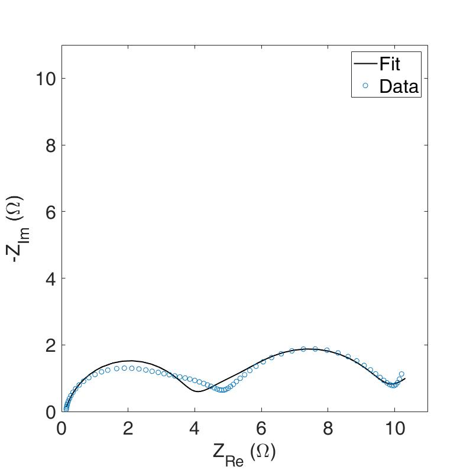
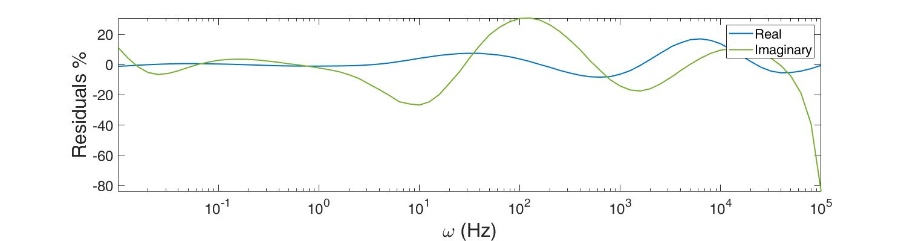
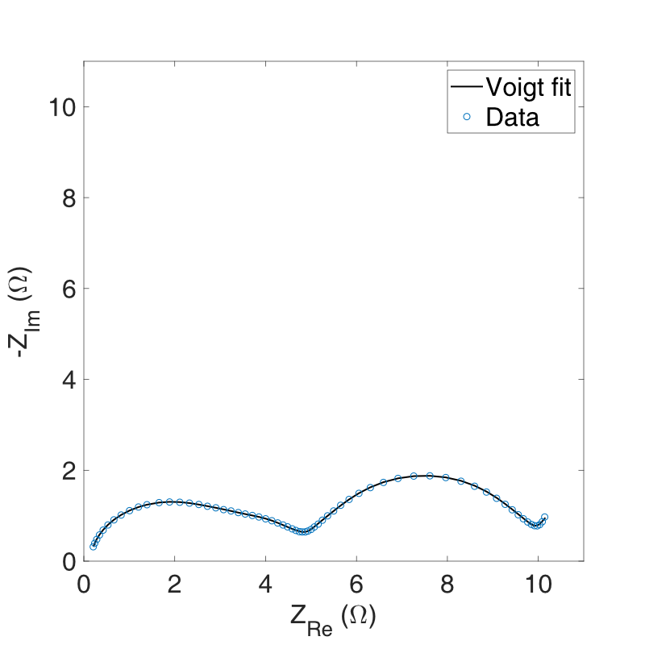
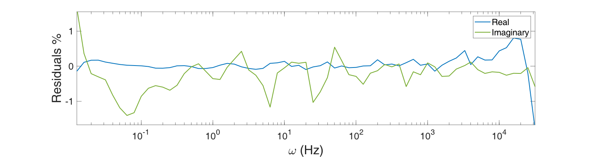

# Electrodes impedance spectra fitting with a physico-chemical model

This repository contains two script to validate and fit impedance spectroscopy data.

Validation of the data is made using the `voigt_fitting.m` script. Note that it require the output of the script  `rnd_par_gen.m` to work. The fitting procedure itself use the  `CNLF_porous_electrode.m`.

For the theory behind the refers to my [thesis manuscript](./resources/scarpioni-federico-master-thesis.pdf).

# Notes for a proper usage

Make sure to have overwritten your correct data path and names. Create also a folder called "par" in the same directory of the script to store all result of the fitting (parameters value) in txt files.

# Screenshots of the fitting results

Residues of the fitting procedure:

# Screenshots of the validation procedure

Residue of the fitting:

